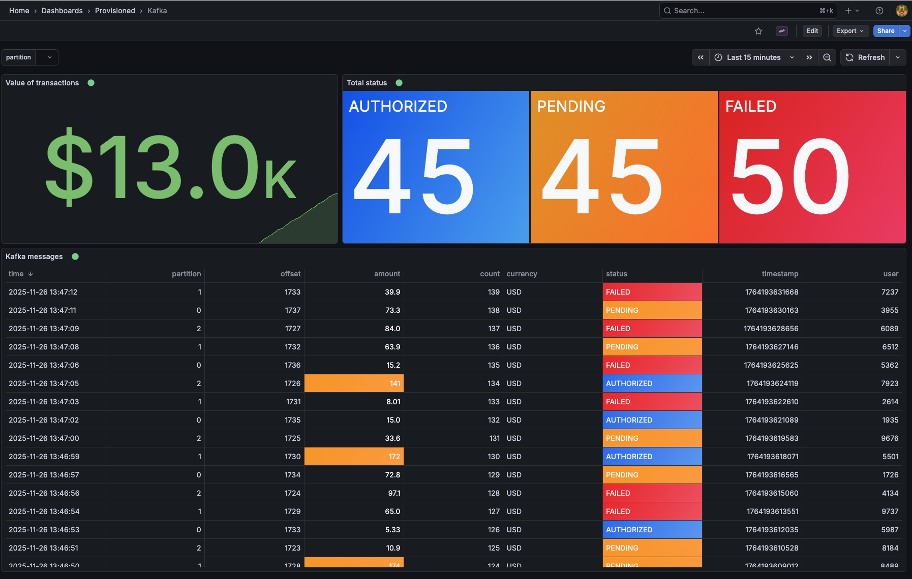
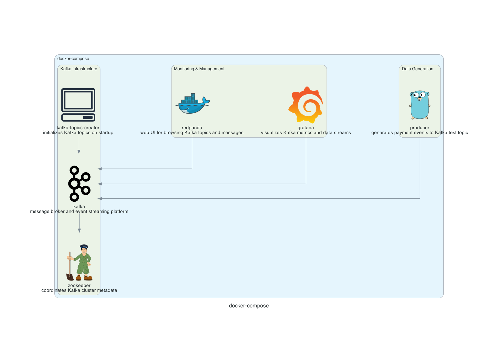

Docker compose file to demo Hamed Karbasi's [grafana-kafka-datasource](https://github.com/hoptical/grafana-kafka-datasource/tree/main/example/go)

Simply run:
```
docker compose up -d
```

The Kafka plugin and example dashboard should be already provisioned:
`http://localhost:3000/d/admfqdh/kafka?orgId=1&from=now-15m&to=now&timezone=browser&var-parition=`

(default user/password is admin/admin)

Redpanda should also be available to inspect the Kafka messages at:
`http://localhost:8080`



The producer code is almost a clone of [the example provided](https://github.com/hoptical/grafana-kafka-datasource/tree/main/example/go) in the kafka-datasource repo.
It has been extended to produce "real life" data via the `-mode` flag.

`-metrics` simulates server metrics:
```
{
  "host": "server-1",
  "cpu": 71.5,
  "ram": 4821,
  "timestamp": 1700000000
}
```

`-iot` simulates sensor readings:
```
{
  "device": "sensor-9",
  "temp": 22.1,
  "humidity": 41,
  "battery": 88,
  "timestamp": 1700000000
}
```

`-logs` simulates log entries:
```
{
  "level": "WARN",
  "service": "auth",
  "message": "invalid token",
  "timestamp": 1700000000
}
```

`-payments` simulates e-commerce transactions:
```
{
  "user": 1004,
  "amount": 19.99,
  "currency": "USD",
  "status": "AUTHORIZED",
  "timestamp": 1700000000
}
```

`-users` simulates user activity:
```
{
  "user_id": 55,
  "action": "login",
  "device": "mobile",
  "timestamp": 1700000000
}

```


